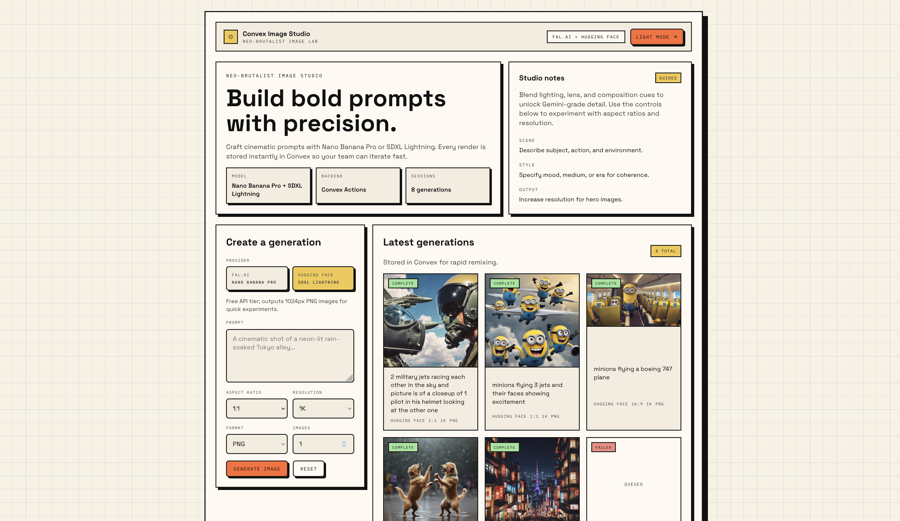

# Convex Image Studio

Neo‑brutalist image generator powered by Convex, Fal.ai, and Hugging Face.

## Setup

### Terminal 1 (Convex)

```bash
bun install
bunx convex dev
```

### Terminal 2 (App)

```bash
bun dev
```

## Environment

Create `.env.local`:

```bash
VITE_CONVEX_URL=<your convex deployment url>
```

Set Convex env vars:

```bash
bunx convex env set HF_TOKEN <your_hf_token>
# Optional paid key
bunx convex env set FAL_KEY <fal_key>
```

## Notes
- Pick “Hugging Face” in the provider toggle to avoid paid usage.

## Screenshot


